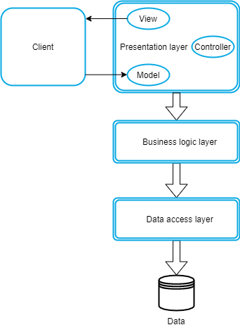
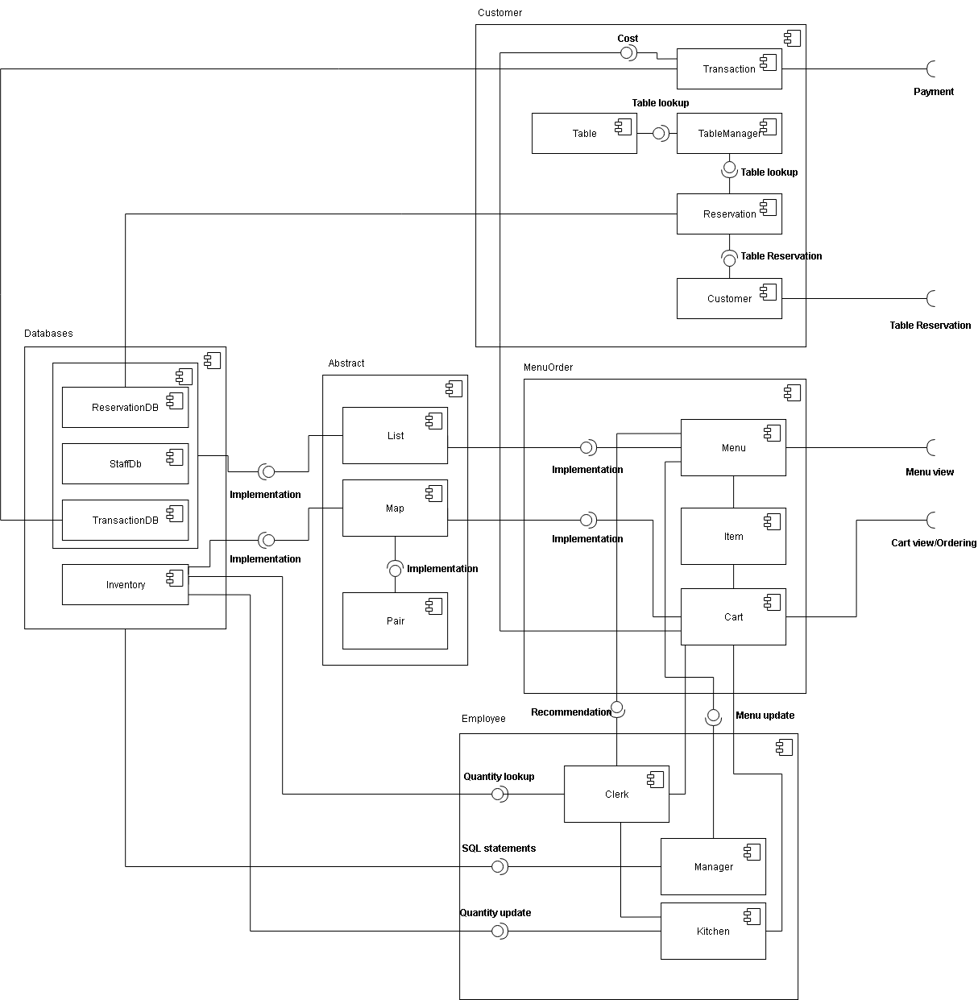
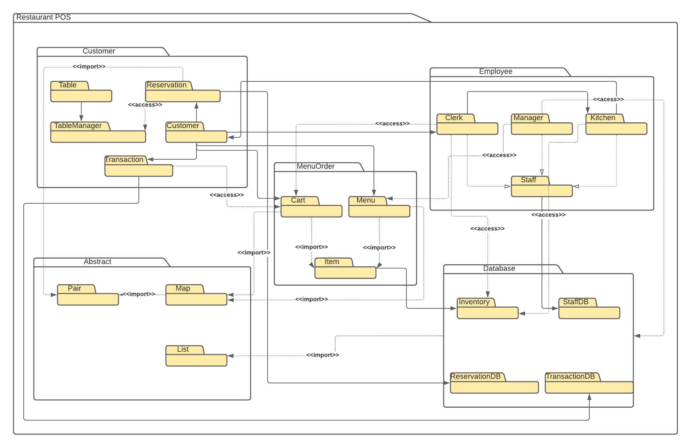

# Architectural Approach

We are choosing the Three-Layer Architecture:

- The `presentation layer`, which contains `View, Controller, Model` in the `MVC` pattern, interacts with the users.
- The `business logic layer` contains the entire logic of the program, most of the code stays here.
- The `data access layer` composes of persistent storage mechanism and the data access layer. It supports connection to the database and to perform insert, update, delete, get data from the database.

## Deployment Diagram

  
 

## Component Diagram

  
 

## Package Diagram

  
 

