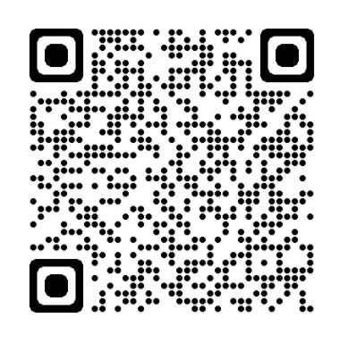

# POS-System

## Introduction
This is a proposed idea of a POS System that is used to deliver a **non-direct contact** between customers and staffs within a restaurant. 
This repo can be cloned and run directly from your machine **(_Please refer to the User Manual Section_)**.


## User Manual

To start the website, run the following commands:

- Install `node_modules` folder and start the website:
```
npm install
npm start
```
- You have to download `node.js` beforehand to run these commands. If there are any missing libraries, please run: `npm install <library-name>`


## Component Structure

```
App
  |
  |___ WelcomePage
  |___ ReservePage
  |___ Signup
  |___ Login
  |___ Thankyou
  |
  |___ Homepage (Ordering Page)
  |           |___ Categories     
  |           |          |___ ItemPage 
  |           |                      |___ Item
  |           |                              |____ PopUp (Modal)
  |           |___ Cart
  |                   |____ ItemCart
  |                                 |___ Confirmation (Modal) 
  |
  |___ Checkout
             |___ VisaCheckOut
             |               
             |___ MomoCheckout
```

## Screen Flow

```
Welcome Page -> SignUp/LogIn ---> Order -> Payment ---> Thank You
             -- Place Order ----> Order -> Payment ---> Thank You
             -- Reserve Table --> Reservation Page ---> Thank You
```

## Website URL and QR Code
You can visit our website using ```URL``` or Scanning ```QR Code``` <br>
**URL:** https://tinyurl.com/kdduymdc <br>
**QR Code:**<br>
<p align="center">
  
</p>
    
## Disclaimer
- We are using photos from `pizzahut.vn` for the purpose of demonstration.
